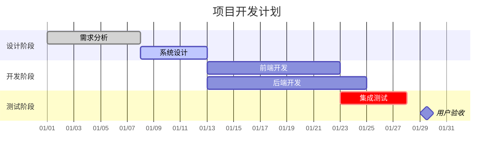
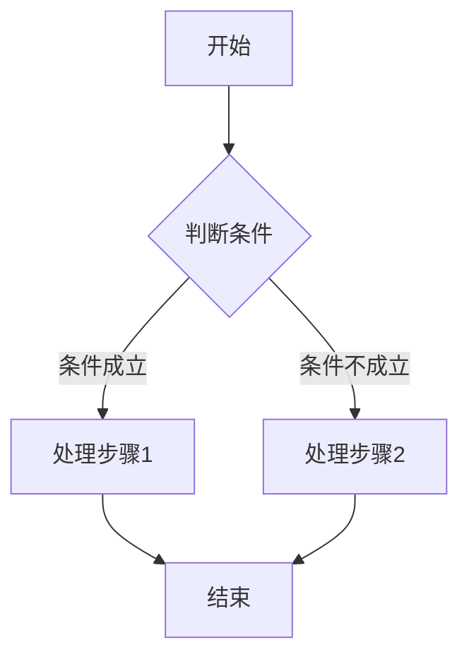
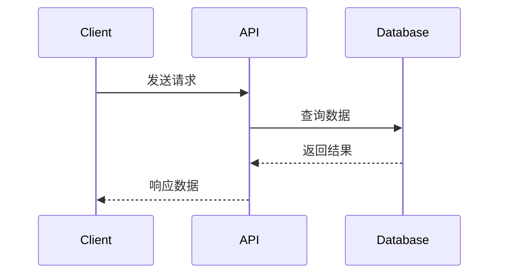

# Markdown to Confluence 示例文档

这是一个示例 Markdown 文件，展示了支持的各种格式。

## 1. 文本格式

你可以使用 **粗体**、*斜体* 和 ~~删除线~~ 来强调文本。

内联代码：`print("Hello World")`

## 2. 列表

### 无序列表
- 第一项
- 第二项
  - 嵌套项 A
  - 嵌套项 B
- 第三项

### 有序列表
1. 第一步
2. 第二步
3. 第三步

## 3. 代码块

### Python 代码
```python
def hello_world():
    print("Hello, Confluence!")
    return True
```

### JavaScript 代码
```javascript
function greet(name) {
    console.log(`Hello, ${name}!`);
}
```

### Bash 代码
```bash
# 安装依赖
pip install atlassian-python-api markdown

# 运行脚本
python md_to_confluence.py doc.md --title "示例"
```

## 4. 表格

| 功能 | 支持 | 说明 |
|------|------|------|
| 标题 | ✓ | H1-H6 都支持 |
| 列表 | ✓ | 有序和无序列表 |
| 代码 | ✓ | 支持语法高亮 |
| 表格 | ✓ | 标准 Markdown 表格 |

## 5. Mermaid 图表

### Gantt 图



### Flowchart 流程图



### Sequence 时序图



## 6. 链接和图片

### 链接
- [Confluence 文档](https://support.atlassian.com/confluence-cloud/docs/)
- [Markdown 指南](https://www.markdownguide.org/)

### 图片（使用在线 URL）


## 7. 引用块和信息面板

> [info] 这是一个信息面板。在 Markdown 中使用引用块语法，并添加 `[info]` 标记。

> [warning] 这是一个警告面板。使用 `[warning]` 标记来创建警告框。

> [note] 这是一个注意面板。使用 `[note]` 标记来创建注意框。

> [tip] 这是一个提示面板。使用 `[tip]` 标记来创建提示框。

## 8. 水平分割线

以上内容

---

以下内容

## 9. 复杂示例

### API 文档示例

#### GET /api/users

获取用户列表。

**请求参数:**

| 参数名 | 类型 | 必需 | 说明 |
|--------|------|------|------|
| page | int | 否 | 页码，默认 1 |
| limit | int | 否 | 每页数量，默认 20 |

**响应示例:**

```json
{
  "users": [
    {
      "id": 1,
      "name": "John Doe",
      "email": "john@example.com"
    }
  ],
  "total": 100
}
```

> [tip] 建议设置适当的 `limit` 值以优化性能。

---

**文档版本:** 1.0  
**最后更新:** 2024-01-01
